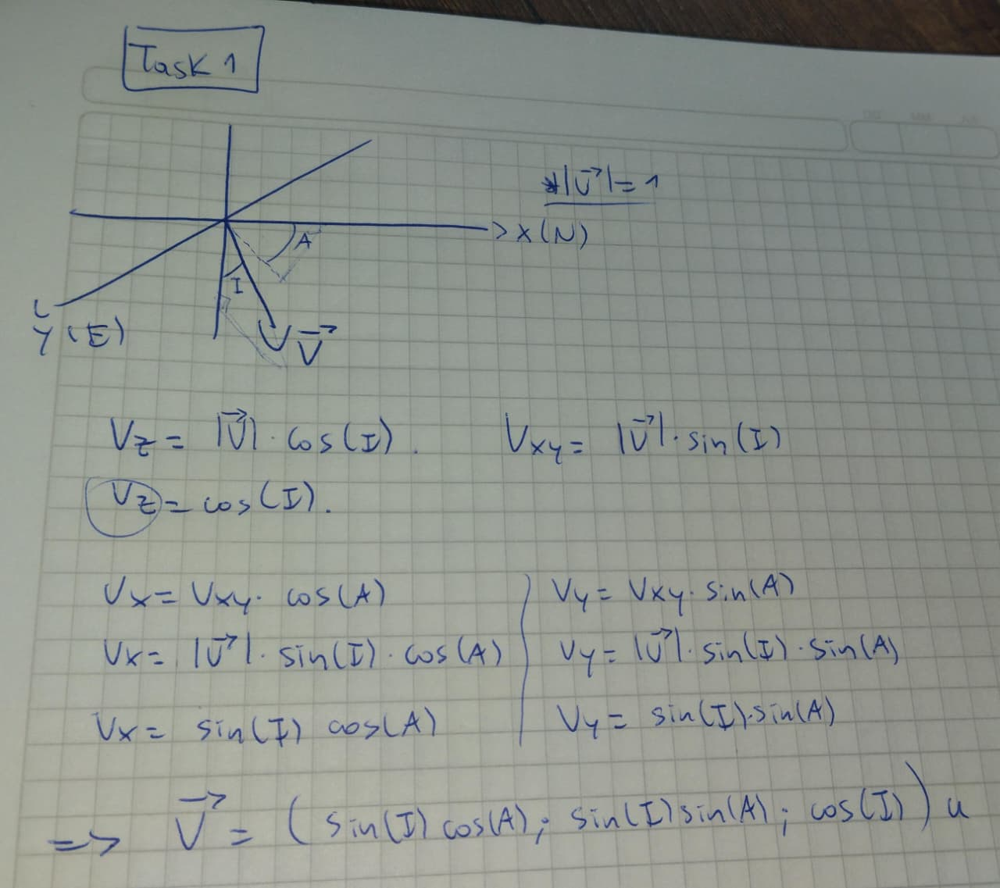
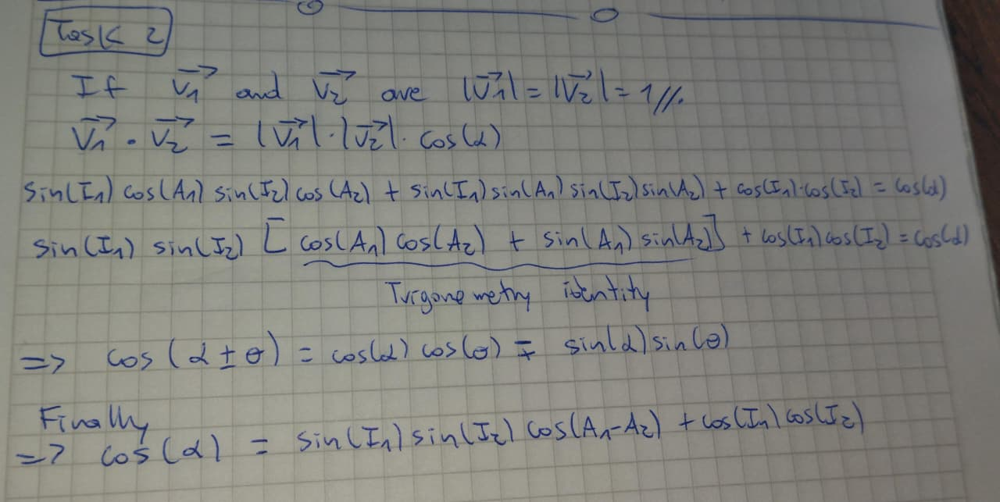

Minimum Curvature Method: Derivation & Fundamentals

Part 1: Core Concepts (Q&A)

1. What does a survey tool measure at one station?
A survey tool measures Direction (Inclination $I$ and Azimuth $A$) at a specific measured depth, not its absolute $(N, E, TVD)$ position.

2. Why does computing a trajectory require an assumption about the path between surveys?
Because only discrete directions at specific depths are measured. The exact continuous path between these stations is unknown, so positions must be inferred. The choice of assumption (e.g., straight line, tangential, circular arc) is the choice of the calculation method.

3. What is the specific assumption of Minimum Curvature?
The wellbore between Station 1 and Station 2 is assumed to be a circular arc that lies entirely within the plane defined by the two tangent vectors, with an arc length exactly equal to the difference in measured depth ($\Delta MD$).

4. How do you compute the dog-leg angle $\alpha$ between two surveys?
It is computed from the dot product of the two unit tangent vectors: $\cos(\alpha) = \hat{t}_1 \cdot \hat{t}_2$.

5. How do you compute the radius $R$ of the Minimum Curvature arc?
From the definition of a circular arc, given an arc length ($\Delta MD$) and a central angle ($\alpha$), the radius is uniquely constrained as: $R = \frac{\Delta MD}{\alpha}$. (MC is not "fitting" a circle; the circle is uniquely determined by these two inputs).

6. Why does the displacement vector use $(\hat{t}_1 + \hat{t}_2)$ as its direction?
Because the displacement vector corresponds to the chord of the circular arc. Geometrically, the chord connecting the start and end of a circular arc lies exactly parallel to the bisector of the two tangent vectors at its endpoints.

7. Why does the displacement have a "ratio factor" of $\frac{2}{\alpha} \tan\left(\frac{\alpha}{2}\right)$?
It is the geometric correction factor. It reconciles the fact that the unnormalized bisector direction $(\hat{t}_1 + \hat{t}_2)$ has a magnitude of $2\cos(\alpha/2)$, while the physical chord length is $2R\sin(\alpha/2)$. When combining these to form the displacement vector and substituting $R = \Delta MD / \alpha$, this specific ratio factor emerges naturally.

Part 2: Mathematical Derivations

Task 1: The Tangent Vector

From the survey tool, we get Inclination ($I$) and Azimuth ($A$). We can map this to a 3D Cartesian system where $X$ is North, $Y$ is East, and $Z$ is True Vertical Depth (TVD - pointing downwards).

With the $+z$ axis pointing downward, azimuth $A$ is measured clockwise from North when viewed from above (standard drilling convention). This gives azimuth a positive sense when rotating from North ($+x$) toward East ($+y$) — consistent with a left-handed coordinate system. The formulas below are derived under this convention.

The horizontal projection magnitude, often called the "horizontal displacement rate" (a good term to know for technical discussions), is:

$$V_{xy} = |\hat{t}| \sin(I) = \sin(I)$$

Using trigonometry, we decompose this into $X$ and $Y$ components, while the $Z$ component depends on $\cos(I)$:

$V_x = V_{xy} \cos(A) = \sin(I) \cos(A)$

$V_y = V_{xy} \sin(A) = \sin(I) \sin(A)$

$V_z = \cos(I)$

Thus, the unit tangent vector at any station is:
The decomposition above corresponds to the geometric construction shown below, derived by hand:


$$\hat{t} = \begin{bmatrix} \sin(I) \cos(A) \\\\ \sin(I) \sin(A) \\\\ \cos(I) \end{bmatrix}$$

Sanity Checks for $\hat{t}$:

Vertical well ($I = 0^\circ$): $\hat{t} = (0, 0, 1)$ $\rightarrow$ Pure down. ✓

Horizontal well, pointing North ($I = 90^\circ, A = 0^\circ$): $\hat{t} = (1, 0, 0)$ $\rightarrow$ Pure North. ✓

Horizontal well, pointing East ($I = 90^\circ, A = 90^\circ$): $\hat{t} = (0, 1, 0)$ $\rightarrow$ Pure East. ✓

Task 2: The Dog-Leg Angle ($\alpha$)

The angle $\alpha$ between two surveys indicates the sharpness of the bend. Large $\alpha$ means a sharp bend (a "dog-leg"). We find $\alpha$ using the dot product of two unit tangent vectors, $|\hat{t}_1| = |\hat{t}_2| = 1$:

$$\hat{t}_1 \cdot \hat{t}_2 = |\hat{t}_1| |\hat{t}_2| \cos(\alpha) = \cos(\alpha)$$

Expanding the dot product algebraically:

$$\cos(\alpha) = \left( \sin I_1 \cos A_1 \cdot \sin I_2 \cos A_2 \right) + \left( \sin I_1 \sin A_1 \cdot \sin I_2 \sin A_2 \right) + \left( \cos I_1 \cos I_2 \right)$$

Factoring out the horizontal components:

$$\cos(\alpha) = \sin I_1 \sin I_2 \left[ \cos A_1 \cos A_2 + \sin A_1 \sin A_2 \right] + \cos I_1 \cos I_2$$

Using the trigonometric identity $\cos(x - y) = \cos(x) \cos(y) + \sin(x) \sin(y)$:

$$\cos(\alpha) = \sin(I_1) \sin(I_2) \cos(A_1 - A_2) + \cos(I_1) \cos(I_2)$$

In the industry, the dog-leg angle is normalized per unit of MD to give the Dog-Leg Severity: $\text{DLS} = \alpha_{\text{deg}} \times (30 / \Delta MD)$ in degrees per 30 meters (metric convention). $\text{DLS} > 4^\circ/30\text{m}$ is the typical fatigue warning threshold for drillstring components.

Interview Note - Wraparound Safety: > Notice that the formula uses $\cos(A_1 - A_2)$. Because cosine is an even function, $\cos(A_1 - A_2) = \cos(A_2 - A_1)$.
This makes the calculation inherently safe against the $360^\circ$ wraparound problem (e.g., jumping from $359^\circ$ to $1^\circ$). $\cos(-358^\circ) = \cos(358^\circ) = \cos(2^\circ)$. The formula never uses the raw azimuth difference directly, only its cosine.

Tasks A-F: Arc Geometry & The Ratio Factor

Physical Meaning of Measured Depth (MD):
MD is the length of the drill pipe. Therefore, $\Delta MD = MD_2 - MD_1$ is exactly the physical arc length ($L$) of the wellbore curve.

Arc Radius: $L = \alpha R \implies \Delta MD = \alpha R \implies R = \frac{\Delta MD}{\alpha}$

Chord Length ($\overline{AB}$): Using simple isosceles triangle geometry inside the circle:

$$\overline{AB} = 2R \sin\left(\frac{\alpha}{2}\right)$$

Chord Direction: The chord connects Station 1 to Station 2. In the plane of the arc, the direction of the chord is perfectly parallel to the bisector of the two tangent vectors, $\vec{B} = \hat{t}_1 + \hat{t}_2$.

However, $\vec{B}$ is not a unit vector. Its magnitude is:

$$|\vec{B}| = |\hat{t}_1 + \hat{t}_2| = 2 \cos\left(\frac{\alpha}{2}\right)$$

Therefore, the true unit direction vector of the displacement is $\hat{u} = \frac{\hat{t}_1 + \hat{t}_2}{2 \cos(\alpha/2)}$.

Constructing the Displacement Vector ($\Delta \vec{r}$):
Displacement is simply (Magnitude) $\times$ (Direction).

$$\Delta \vec{r} = (\text{Chord Length}) \times \hat{u}$$

$$\Delta \vec{r} = \left[ 2R \sin\left(\frac{\alpha}{2}\right) \right] \cdot \left[ \frac{\hat{t}_1 + \hat{t}_2}{2 \cos(\alpha/2)} \right]$$

$$\Delta \vec{r} = R \left[ \frac{\sin(\alpha/2)}{\cos(\alpha/2)} \right] (\hat{t}_1 + \hat{t}_2) = R \tan\left(\frac{\alpha}{2}\right) (\hat{t}_1 + \hat{t}_2)$$

Deriving the Ratio Factor (RF):
Substitute $R = \frac{\Delta MD}{\alpha}$:

$$\Delta \vec{r} = \frac{\Delta MD}{\alpha} \tan\left(\frac{\alpha}{2}\right) (\hat{t}_1 + \hat{t}_2)$$

In the industry, the standard Minimum Curvature equation factors the displacement as $\frac{\Delta MD}{2} (\hat{t}_1 + \hat{t}_2)$ multiplied by a Ratio Factor ($RF$):

$$\Delta \vec{r} = \frac{\Delta MD}{2} \cdot \left[ \frac{2}{\alpha} \tan\left(\frac{\alpha}{2}\right) \right] \cdot (\hat{t}_1 + \hat{t}_2)$$

Thus, the Ratio Factor is proven to be:

$$RF = \frac{2}{\alpha} \tan\left(\frac{\alpha}{2}\right)$$

The full chain of arithmetic — from chord length to ratio factor — was derived by hand in the figure below:


Task G: Small - $$\alpha$$ Limit and Numerical Stability

Using the Taylor expansion $\tan(x) = x + \frac{x^3}{3} + O(x^5)$:

$$RF = \frac{2}{\alpha}\tan\left(\frac{\alpha}{2}\right) = \frac{2}{\alpha}\left[\frac{\alpha}{2} + \frac{(\alpha/2)^3}{3} + \ldots\right] = 1 + \frac{\alpha^2}{12} + O(\alpha^4)$$

As $\alpha \to 0$, $RF \to 1$, and the displacement formula reduces to $\Delta \vec{r} = \Delta MD \cdot \frac{\hat{t}_1 + \hat{t}_2}{2}$ — which is the Balanced Tangential method. Minimum Curvature and Balanced Tangential agree in the straight-hole limit and diverge only where curvature matters.

In the implementation, evaluating $(2/\alpha)*\tan(\alpha/2)$ directly for very small $\alpha$ would produce a $0/0$ indeterminate form in floating-point arithmetic. The code therefore substitutes $RF = 1$ whenever $\alpha < 10^{-9}$ radians. The residual error is $O(\alpha^2/12) \approx 10^{-19}$, which is below IEEE 754 double-precision epsilon. The numerical guard is mathematically principled, not a hack.

Part 3: Mapping to the Implementation

```
Derivation                              →  engine code
────────────────────────────────────────────────────────────────────────
cos α = sin I₁ sin I₂ cos(A₂-A₁)        →  cos_alpha = np.sin(inc_1) * np.sin(inc_2)
        + cos I₁ cos I₂                      * np.cos(azi_2 - azi_1)
                                             + np.cos(inc_1) * np.cos(inc_2)

α = arccos(cos α), clipped to [-1, 1]   →  cos_alpha = np.clip(cos_alpha, -1.0, 1.0)
for floating-point safety                  alpha = np.arccos(cos_alpha)

RF = (2/α) tan(α/2),                    →  rf = np.where(alpha < 1e-9, 1.0,
RF → 1 as α → 0 by Taylor expansion         (2.0/alpha_safe) * np.tan(alpha_safe/2.0))

Δ_TVD = (Δ_MD/2)(cos I₁ + cos I₂) · RF  →  delta_tvd = (d_md/2) * (np.cos(inc_1)
                                             + np.cos(inc_2)) * rf

Δ_N = (Δ_MD/2)(sin I₁ cos A₁           →  delta_ns = (d_md/2) * (np.sin(inc_1)
      + sin I₂ cos A₂) · RF                  * np.cos(azi_1) + np.sin(inc_2)
                                             * np.cos(azi_2)) * rf

Δ_E = (Δ_MD/2)(sin I₁ sin A₁           →  delta_ew = (d_md/2) * (np.sin(inc_1)
      + sin I₂ sin A₂) · RF                  * np.sin(azi_1) + np.sin(inc_2)
                                             * np.sin(azi_2)) * rf

DLS = α_deg · (30 / Δ_MD)               →  dls_interval = np.degrees(alpha) * (30.0
(metric: degrees per 30 meters)              / d_md_safe)
```